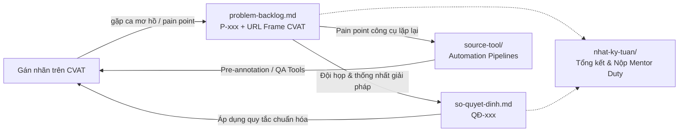

# Repo Đội T030 (P-030) — AI20K Build Phase Cohort 4A

Kho lưu trữ và quản lý quy trình gán nhãn dữ liệu (Data Labeling, Quality Assurance & Automation Tools) của Đội **T030** (Mã repo: **P-030**).

> [!NOTE]
> Repo được vận hành theo mô hình chuẩn công nghiệp: phối hợp 5 thành viên (mô hình Buddy System 3 IT + 2 Phi IT), quản lý chất lượng qua ma trận Review chéo (Cross-Review), đồng bộ hóa tri thức qua Backlog & Sổ quyết định, và tăng tốc năng suất bằng các công cụ tự động hóa bản địa.

---

## 1. Cấu trúc tài liệu và luồng dữ liệu

| Đường dẫn | Mục đích sử dụng | Chu kỳ cập nhật |
|---|---|---|
| [`nhat-ky-tuan/`](nhat-ky-tuan/) | Nhật ký tiến độ chi tiết: phân công job, % hoàn thành, tỉ lệ review lỗi (First-pass Yield) | Cập nhật liên tục, chốt trước 12:00 trưa ngày Mentor Duty |
| [`problem-backlog.md`](problem-backlog.md) | Sổ theo dõi edge cases, ca mơ hồ/chưa rõ luật trên CVAT (trỏ đúng URL frame) và pain points công cụ | **Ngay khi gặp** trong lúc gán nhãn |
| [`so-quyet-dinh.md`](so-quyet-dinh.md) | Sổ lưu trữ các quy tắc và quyết định đã thống nhất của đội (QĐ-xxx) kèm lý do lựa chọn | Mỗi khi đội chốt phương án cho một P-xxx |
| [`source-tool/`](source-tool/) | Mã nguồn các công cụ tự động hóa do đội tự phát triển (`auto-annotator`, `semantic-segmenter`, `browser-copilot`) | Khi giải quyết pain point công cụ thực tế |

---

## 2. Nhân sự & Cơ cấu điều phối Đội T030

Đội vận hành theo mô hình **Buddy System** (1 IT kèm 1 Phi IT) nhằm tối ưu hóa thế mạnh tỉ mỉ của các bạn Phi IT và năng lực công nghệ của các bạn IT:

| Vị trí | Thành viên / Handle | Nhiệm vụ chính |
|---|---|---|
| **Lead & Quality Auditor** | Lê Đức Mạnh ([@ManhLD424](https://github.com/ManhLD424) · MSSV: `2A202602122`) | Điều phối Task/Job trên CVAT, quản trị repo GitHub, giữ Sổ quyết định, phát triển automation tools, audit ngẫu nhiên 15-20% mọi job, nộp báo cáo Mentor Duty |
| **Reviewer chính 1 · Buddy** | Thành viên IT 2 (`@thanh-vien-it2`) | Làm Buddy kèm cặp 1-1 cho Bạn Phi IT 1; Review 100% job của Phi IT 1; gán job được phân công; hỗ trợ phát triển tool |
| **Reviewer chính 2 · Buddy** | Thành viên IT 3 (`@thanh-vien-it3`) | Làm Buddy kèm cặp 1-1 cho Bạn Phi IT 2; Review 100% job của Phi IT 2; gán job được phân công; cùng biểu quyết các ca edge cases |
| **Annotator chuyên trách 1** | Thành viên Phi IT 1 (`@thanh-vien-phi-it1`) | Tập trung gán nhãn tỉ mỉ theo guideline; khi gặp ca khó thực hiện Open Issue trên CVAT và báo Buddy IT 2; sửa các frame được trả về |
| **Annotator chuyên trách 2** | Thành viên Phi IT 2 (`@thanh-vien-phi-it2`) | Tập trung gán nhãn chi tiết đúng shape; Open Issue trên CVAT khi gặp vật thể mờ/khuất; phối hợp cùng Buddy IT 3 |

> [!IMPORTANT]
> **Nguyên tắc vàng**: Tuyệt đối **không ai được tự review job do chính mình gán**. Mọi job đều phải qua Review chéo và đạt nghiệm thu trước khi đánh dấu hoàn thành.

---

## 3. Liên kết Task CVAT Đội T030

- **Máy chủ CVAT:** [https://cvat.note.transformerlabs.ai](https://cvat.note.transformerlabs.ai) (Organization: `ai20k-cohort-4a`)
- **Task 149 (Object Detection, Polyline, Polygon Drivable Area):**
  - [Job 1447](https://cvat.note.transformerlabs.ai/tasks/149/jobs/1447) (25 frames — Đã hoàn thành sơ bộ 333 annotations và review 100%)
- **Task 203 (Semantic Segmentation 19 Classes Cityscapes):**
  - [Job 1663](https://cvat.note.transformerlabs.ai/tasks/203/jobs/1663) (25 frames — Đã hoàn thành 734 clean masks RLE và nghiệm thu)

---

## 4. Quy ước làm việc

- **Quy ước mã định danh:**
  - Vấn đề / Rào cản: `P-001`, `P-002`, `P-003`,... (tăng dần).
  - Quyết định chuẩn hóa: `QĐ-001`, `QĐ-002`, `QĐ-003`,... (tăng dần).
- **Quy ước dẫn chiếu CVAT:** Trỏ trực tiếp đến URL của frame cụ thể:
  `https://cvat.note.transformerlabs.ai/tasks/<task_id>/jobs/<job_id>?frame=<n>`
- **Dẫn chiếu tài liệu:** Ghi rõ số mục trong tài liệu (`§2`, `§3.1`, `§7` của BBox Guideline hoặc `Rule 01/02/03` của Semantic Segmentation Guideline).
