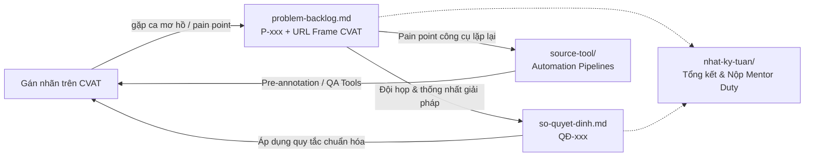

# Repo Đội T030 (P-030) — AI20K Build Phase Cohort 4A

Kho lưu trữ và quản lý quy trình gán nhãn dữ liệu (Data Labeling, Quality Assurance & Automation Tools) của Đội **T030** (Mã repo: **P-030**).

> [!NOTE]
> Repo được vận hành theo mô hình phân công vai trò chuyên trách: phối hợp giữa người gán nhãn, kiểm duyệt viên và trưởng nhóm, quản lý chất lượng qua quy trình kiểm duyệt chéo (Cross-Review), đồng bộ hóa tri thức qua Backlog & Sổ quyết định, và tăng tốc năng suất bằng các công cụ tự động hóa do đội tự phát triển.

---

## 1. Cấu trúc tài liệu và luồng dữ liệu

| Đường dẫn | Mục đích sử dụng | Chu kỳ cập nhật |
|---|---|---|
| [`nhat-ky-tuan/`](nhat-ky-tuan/) | Nhật ký tiến độ chi tiết: phân công job, % hoàn thành, tỉ lệ review lỗi (First-pass Yield) | Cập nhật liên tục, chốt trước 12:00 trưa ngày Mentor Duty |
| [`problem-backlog.md`](problem-backlog.md) | Sổ theo dõi edge cases, ca mơ hồ/chưa rõ luật trên CVAT (trỏ đúng URL frame) và pain points công cụ | **Ngay khi gặp** trong lúc gán nhãn |
| [`so-quyet-dinh.md`](so-quyet-dinh.md) | Sổ lưu trữ các quy tắc và quyết định đã thống nhất của đội (QĐ-xxx) kèm lý do lựa chọn | Mỗi khi đội chốt phương án cho một P-xxx |
| [`submissions/`](submissions/) | Lưu trữ các tập dữ liệu, nhãn và báo cáo bài làm thực tế của các thành viên trong đội | Khi thành viên hoàn thành và qua nghiệm thu |
| [`source-tool/`](source-tool/) | Mã nguồn các công cụ tự động hóa do đội tự phát triển (`auto-annotator`, `semantic-segmenter`, `polygon-cleaner`, `browser-copilot`) | Khi giải quyết pain point công cụ thực tế |

---

## 2. Nhân sự & Cơ cấu điều phối Đội T030

Đội vận hành với sự phân công vai trò rõ ràng, kết hợp hỗ trợ kỹ thuật trực tiếp để bảo đảm tiến độ và chất lượng dữ liệu:

| Vị trí | Thành viên / Handle | Nhiệm vụ chính |
|---|---|---|
| **Trưởng nhóm & Kiểm toán chất lượng** | Lê Đức Mạnh ([@ManhLD424](https://github.com/ManhLD424) · MSSV: `02122`) | Điều phối Task/Job trên CVAT, quản trị repo GitHub, giữ Sổ quyết định, phát triển công cụ tự động hóa, audit ngẫu nhiên 15-20% mọi job, nộp báo cáo Mentor Duty |
| **Kiểm duyệt chính** | Võ Trọng Nghĩa (MSSV: `02072`) | Phụ trách hỗ trợ và kiểm duyệt chất lượng 100% các job của thành viên gán nhãn; tự gán job được phân công; hỗ trợ phát triển công cụ |
| ~~**Thành viên**~~ | ~~Vũ Việt Long~~ (MSSV: `02341`) | *(Đã dừng việc theo học chương trình)* |
| **Thành viên gán nhãn 1** | Tống Thanh Danh (MSSV: `02299`) | Tập trung gán nhãn theo guideline; khi gặp ca khó tạo Issue trên CVAT và báo người kiểm duyệt hỗ trợ; hoàn thiện các frame được trả về |
| **Thành viên gán nhãn 2** | Phạm Hoàng Anh (MSSV: `02128`) | Tập trung gán nhãn chi tiết đúng hình dạng; tạo Issue trên CVAT khi gặp vật thể mờ/khuất; phối hợp cùng người kiểm duyệt |

> [!IMPORTANT]
> **Nguyên tắc vàng**: Tuyệt đối **không ai được tự review job do chính mình gán**. Mọi job đều phải qua kiểm duyệt chéo độc lập và đạt nghiệm thu trước khi đánh dấu hoàn thành.

---

## 3. Liên kết Task CVAT Đội T030

- **Máy chủ CVAT:** [https://cvat.note.transformerlabs.ai](https://cvat.note.transformerlabs.ai) (Organization: `ai20k-cohort-4a`)
- **Task 149 (Object Detection, Polyline, Polygon Drivable Area):**
  - [Job 1447](https://cvat.note.transformerlabs.ai/tasks/149/jobs/1447) (Đã hoàn thành chuẩn xác, đủ thuộc tính hình học và nghiệm thu 100%)
- **Task 203 (Semantic Segmentation 19 Classes Cityscapes):**
  - [Job 1663](https://cvat.note.transformerlabs.ai/tasks/203/jobs/1663) (Đã tái gán nhãn chuẩn RLE native, kiểm toán trực tiếp 0 pixel chồng lấn và nghiệm thu 100%)
  - **Tập Phân đoạn Ngữ nghĩa Nhóm G04 (Tuần 01):** [w1/segmentation/G04/](submissions/w1-segmentation-G04-Danh/) (Đã hoàn thành, làm sạch nhãn và nghiệm thu 100%)

---

## 4. Quy ước làm việc

- **Quy ước mã định danh:**
  - Vấn đề / Rào cản: `P-001`, `P-002`, `P-003`,... (tăng dần).
  - Quyết định chuẩn hóa: `QĐ-001`, `QĐ-002`, `QĐ-003`,... (tăng dần).
- **Quy ước dẫn chiếu CVAT:** Trỏ trực tiếp đến URL của frame cụ thể:
  `https://cvat.note.transformerlabs.ai/tasks/<task_id>/jobs/<job_id>?frame=<n>`
- **Dẫn chiếu tài liệu:** Ghi rõ số mục trong tài liệu (`§2`, `§3.1`, `§7` của BBox Guideline hoặc `Rule 01/02/03` của Semantic Segmentation Guideline).
