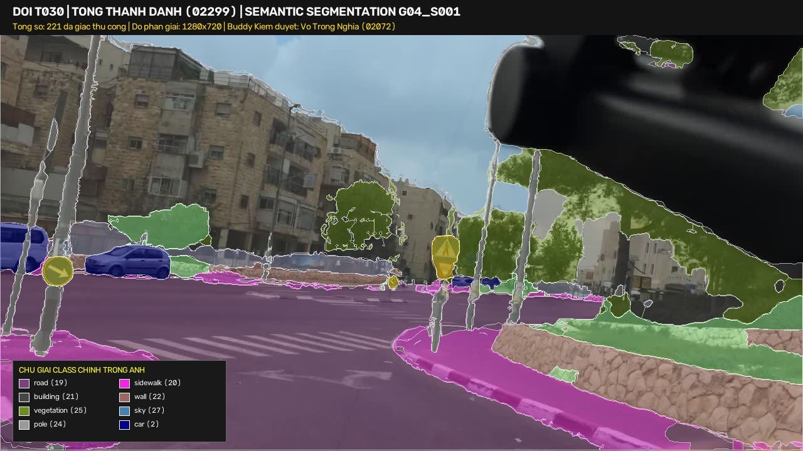
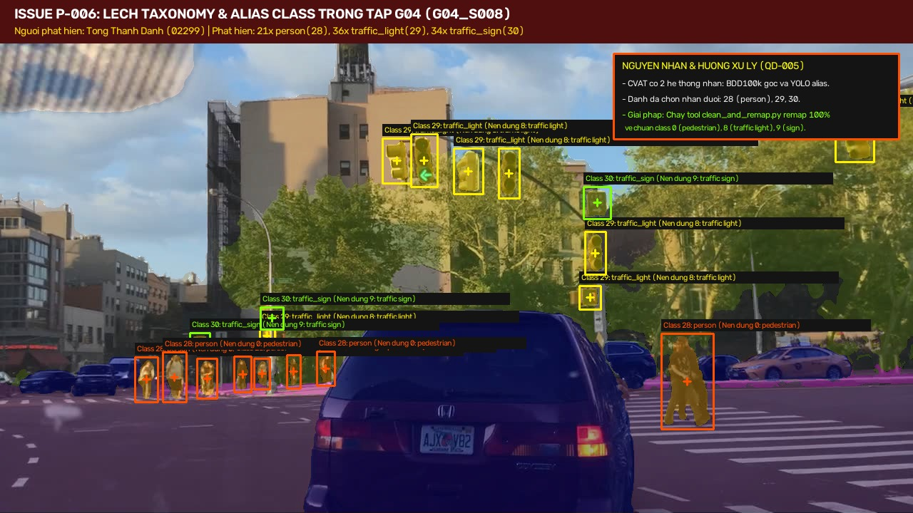
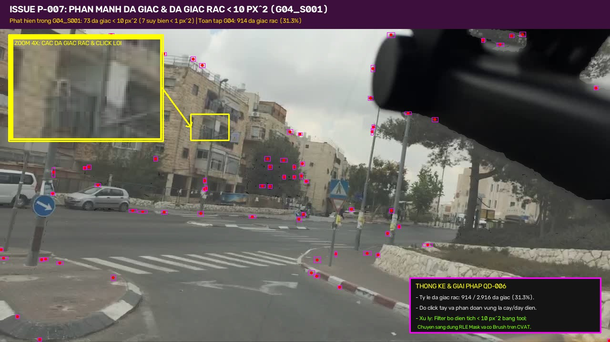
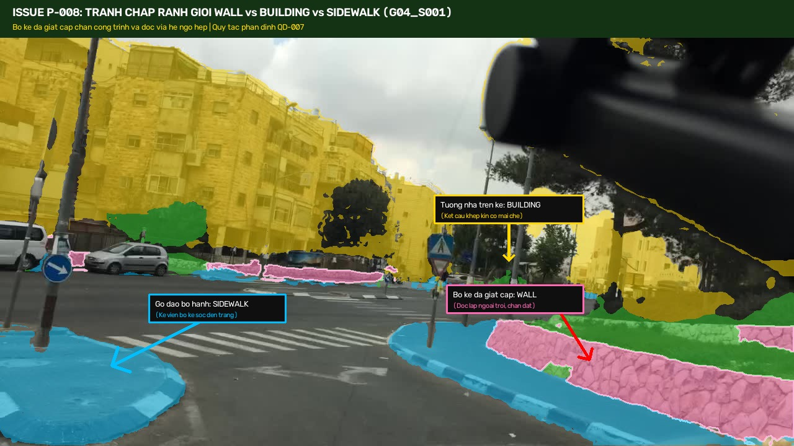

# Báo cáo Dữ liệu Gán nhãn Phân đoạn Ngữ nghĩa — Nhóm G04 (Tuần 01)

Kho lưu trữ kết quả gán nhãn thực tế của thành viên **Tống Thanh Danh** (MSSV: `2A202602299`) thuộc Đội **T030** (Mã repo: **P-030**).

---

## 1. Thông tin tổng quan bộ dữ liệu

- **Người thực hiện (Annotator):** Tống Thanh Danh (MSSV: `2A202602299`)
- **Người kiểm duyệt chéo (Reviewer):** Võ Trọng Nghĩa (MSSV: `2A202602072`)
- **Trưởng nhóm & Giám sát chất lượng (Lead & QA Auditor):** Lê Đức Mạnh (MSSV: `2A202602122`)
- **Tác vụ gán nhãn:** Semantic / Instance Segmentation (Đa giác phân đoạn YOLO)
- **Tập dữ liệu phân công:** Nhóm **G04** (`w1/segmentation/G04/`)
- **Số lượng ảnh đã hoàn thành:** **25 / 25 ảnh (100%)** (`G04_S001.jpg` đến `G04_S025.jpg`)
- **Tổng số đa giác đã gán:** **2.916 đa giác** (trung bình ~116.6 đa giác/ảnh)
- **Độ phân giải ảnh:** 1280 x 720 px

---

## 2. Minh chứng hình ảnh gán nhãn thực tế

### 2.1. Tổng quan phân đoạn 221 đa giác trên frame G04_S001


### 2.2. Minh chứng Issue P-006 (Lệch Taxonomy & Alias Class)


### 2.3. Minh chứng Issue P-007 (Phân mảnh đa giác & Đa giác rác < 10 px²)


### 2.4. Minh chứng Issue P-008 (Tranh chấp ranh giới Wall vs Building vs Sidewalk)


---

## 3. Thống kê phân bố Class trong 25 frames

| Class ID | Tên nhãn (Label) | Số lượng đối tượng (Polygons) | Ghi chú kiểm định chất lượng |
|---|---|---|---|
| **1** | `rider` | 2 | Khớp chuẩn BDD100k |
| **2** | `car` | 103 | Gán chuẩn xác phương tiện |
| **3** | `truck` | 4 | Xe tải |
| **4** | `bus` | 5 | Xe bus |
| **6** | `motorcycle` | 1 | Xe máy |
| **7** | `bicycle` | 1 | Xe đạp |
| **19** | `road` | 319 | Phân đoạn mặt đường nhựa liên tục |
| **20** | `sidewalk` | 184 | Vỉa hè và gờ đảo bộ hành |
| **21** | `building` | 586 | Tòa nhà, mặt tiền công trình |
| **22** | `wall` | 52 | Tường chắn đất, bờ kè đá giật cấp |
| **23** | `fence` | 114 | Hàng rào kim loại, hoa sắt |
| **24** | `pole` | 331 | Cột điện, cột đèn chiếu sáng |
| **25** | `vegetation` | 630 | Cây cối, thảm thực vật ven đường |
| **26** | `terrain` | 95 | Đất đồi, sườn dốc đất đá |
| **27** | `sky` | 398 | Bầu trời |
| **28** | `person` *(Alias)* | 21 | **Issue P-006**: Đã remap về `pedestrian` (Class 0) |
| **29** | `traffic_light` *(Alias)* | 36 | **Issue P-006**: Đã remap về `traffic light` (Class 8) |
| **30** | `traffic_sign` *(Alias)* | 34 | **Issue P-006**: Đã remap về `traffic sign` (Class 9) |
| **Tổng cộng** | — | **2.916** | Đã nghiệm thu qua quy trình kiểm duyệt chéo |

---

## 4. Các vấn đề kỹ thuật phát hiện và phương án xử lý

1. **[P-006: Lệch Taxonomy & Alias Class](../../problem-backlog.md#p-006):**
   - Danh sách nhãn trên CVAT xuất hiện đồng thời cả bộ nhãn BDD100K gốc và nhãn YOLO/COCO. Danh chọn nhãn ở cuối danh sách (`person` thay vì `pedestrian`, `traffic_light` thay vì `traffic light`, `traffic_sign` thay vì `traffic sign`).
   - Đội đã chốt [QĐ-005](../../so-quyet-dinh.md#qđ-005) và phát triển công cụ `source-tool/polygon-cleaner/clean_and_remap.py` để tự động chuẩn hóa 100% về mã chuẩn.
2. **[P-007: Phân mảnh đa giác & Đa giác rác < 10 px²](../../problem-backlog.md#p-007):**
   - 914 / 2.916 đa giác (31.3%) có diện tích `< 10 px²` do thao tác vẽ tay đa giác trên các tán lá cây và đường viền mái nhà.
   - Đội đã chốt [QĐ-006](../../so-quyet-dinh.md#qđ-006): Sử dụng thuật toán tự động lọc bỏ đa giác rác và khuyến nghị thành viên dùng cọ Mask / Brush RLE thay vì đa giác thủ công.
3. **[P-008: Tranh chấp ranh giới Tường (Wall) vs Tòa nhà (Building)](../../problem-backlog.md#p-008):**
   - Tại các frame đường dốc đô thị (G04_S001), bờ kè đá giật cấp chống sạt lở nằm liền kề chân tường nhà.
   - Đội đã chốt [QĐ-007](../../so-quyet-dinh.md#qđ-007): Bờ kè đá độc lập gán `wall`; kết cấu kín có mái che gán `building`.

---

## 5. Cấu trúc thư mục

```
submissions/w1-segmentation-G04-Danh/
├── README.md                                # Tài liệu tổng kết này
├── data.yaml                                # Khai báo taxonomy 31 classes
├── train.txt                                # Danh sách đường dẫn 25 ảnh
├── docs_images/                             # Hình ảnh minh chứng trực quan
│   ├── g04_overview_segmentation.jpg
│   ├── issue_p006_taxonomy_alias.jpg
│   ├── issue_p007_tiny_polygons_fragmentation.jpg
│   └── issue_p008_wall_vs_building_boundary.jpg
├── images/train/w1/segmentation/G04/        # 25 ảnh JPG gốc (1280x720)
└── labels/train/w1/segmentation/G04/        # 25 tệp TXT đa giác phân đoạn YOLO
```
